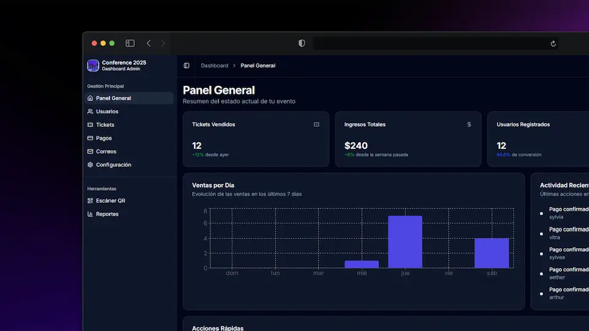

# Landing Conference Next.js

<p align="center">
  
</p>

Landing y sistema de gestión para conferencias, desarrollado con Next.js 14, Prisma, TailwindCSS y autenticación avanzada. Permite registro de asistentes, gestión de tickets, pagos, emails automáticos y dashboard administrativo.

## 🚀 Características principales

- Landing page moderna y responsive
- Registro de asistentes con validación y email de confirmación
- Generación y gestión de tickets con QR
- Integración con MercadoPago para pagos
- Panel de administración con métricas, usuarios, tickets, pagos y configuración
- Modo oscuro y personalización visual
- Emails automáticos (confirmación, ticket, recordatorios)
- Configuración dinámica de evento, URLs, emails y seguridad
- Soporte para roles de administrador y staff

## 🛠️ Instalación y uso local

1. **Clona el repositorio:**
   ```bash
   git clone <url-del-repo>
   cd landing-conference-nextjs
   ```
2. **Instala dependencias:**
   ```bash
   npm install
   ```
3. **Configura las variables de entorno:**
   Crea un archivo `.env` basado en `.env.example` y completa los valores necesarios:
   - `DATABASE_URL` (ejemplo: `file:./prisma/dev.db` para SQLite)
   - `NEXTAUTH_SECRET`
   - `NEXTAUTH_URL`
   - `RESEND_API_KEY` (para emails)
   - `MERCADOPAGO_ACCESS_TOKEN`
   - `NEXT_PUBLIC_GOOGLE_MAPS_API_KEY`

4. **Ejecuta las migraciones y seed:**
   ```bash
   npx prisma migrate dev --name init
   npm run seed
   ```
5. **Inicia el servidor de desarrollo:**
   ```bash
   npm run dev
   ```

## 📂 Estructura principal de carpetas

```
landing-conference-nextjs/
├── public/
│   └── landing-conference.webp
├── prisma/
│   ├── schema.prisma
│   └── migrations/
├── src/
│   ├── app/           # Rutas y páginas Next.js
│   ├── components/    # Componentes reutilizables
│   ├── lib/           # Lógica de negocio y utilidades
│   ├── hooks/         # Custom hooks
│   ├── context/       # Contextos globales
│   ├── types/         # Tipos y definiciones
│   └── schemas/       # Validaciones y esquemas
├── package.json
├── README.md
└── ...
```

## 📜 Scripts útiles

- `npm run dev` — Inicia el servidor de desarrollo
- `npm run build` — Compila la app para producción
- `npm run start` — Inicia la app en modo producción
- `npm run lint` — Linting del código
- `npx prisma migrate dev` — Ejecuta migraciones de base de datos
- `npm run seed` — Ejecuta los scripts de seed de la base de datos

## 🔐 Variables de entorno

Asegúrate de definir en `.env`:

- `DATABASE_URL`
- `NEXTAUTH_SECRET`
- `NEXTAUTH_URL`
- `RESEND_API_KEY`
- `MERCADOPAGO_ACCESS_TOKEN`
- `NEXT_PUBLIC_GOOGLE_MAPS_API_KEY`

## 👨‍💻 Créditos

- Diseño y desarrollo: [Tu nombre o equipo]
- Basado en Next.js, Prisma, TailwindCSS, MercadoPago, Resend

## 📄 Licencia

Este proyecto está bajo la licencia MIT.
